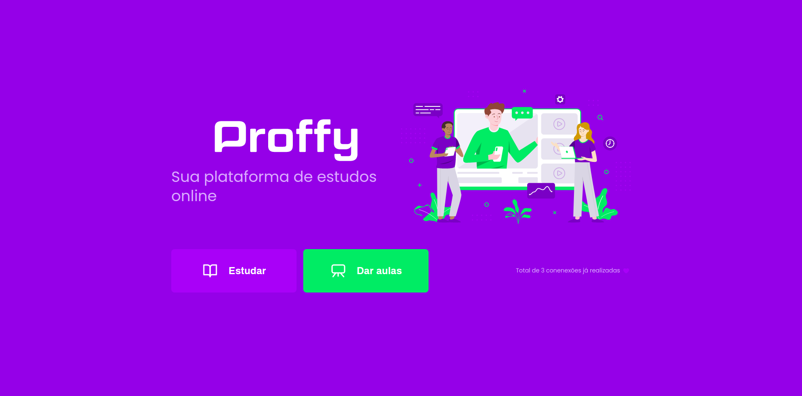
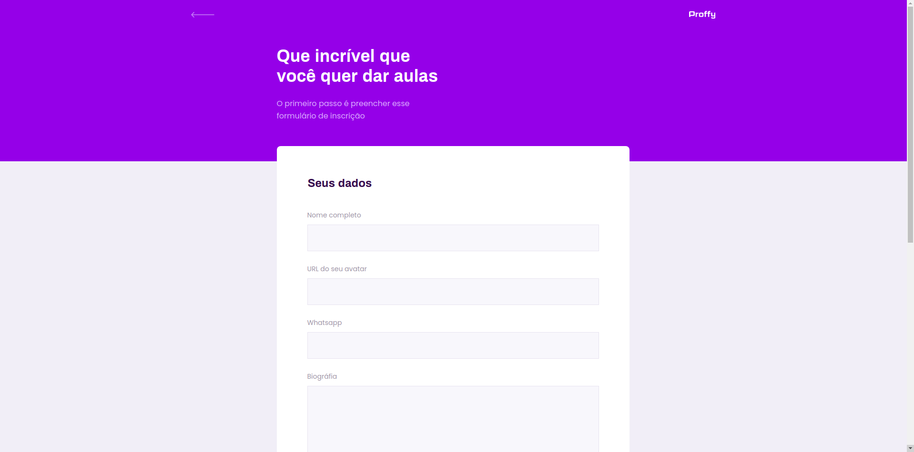
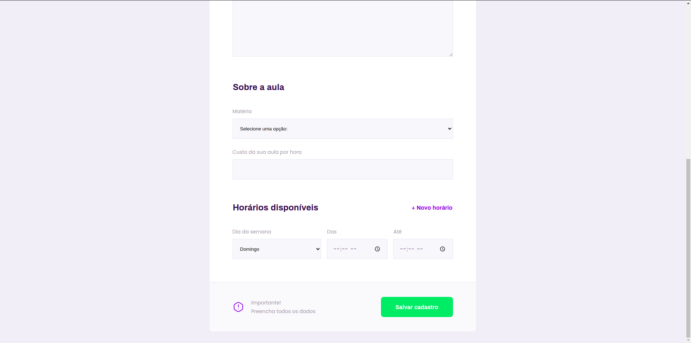
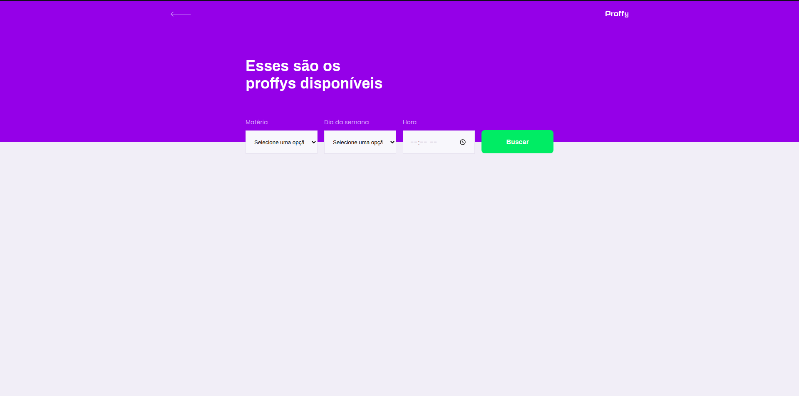
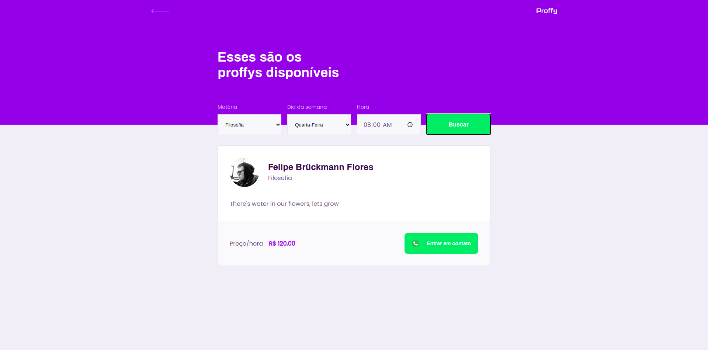

<h2 align="center"><Strong>Proffy</strong>, um projeto da Rocketseat :rocket: </h2>
 

 Este projeto foi desenvolvido durante a semana <strong>NLW</strong>, um evento da Rocketseat que dura uma semana, e trás o desáfio de <strong>desenvolver um app do zero.</strong>

Este app tem como objetivo fazer <strong>conexões de alunos que buscam estudar, com professores que querem ensinar</strong>, de forma com que o aluno pode escolher por matéria, dia da semana que lhe é mais conveniente, e também por hora, o professor também faz as mesmas escolhas na hora de fazer o cadastro

o app conta com uma versão <strong>WEB</strong> e uma versão <strong>MOBILE</strong>

 <strong>Para desenvolver a versão web foi usada as seguintes tecnologias:</strong>

<ul> 
  <li><strong>ReactJS</li>
  <li>Typescript</li>
  <li>Node</li>
</ul>

E para desenvolver a versão mobile foi utilizada as seguintes tecnologias:

<ul>
  <li>React-native</li>
  <li>Typescript</li>
  <li>Expo</li>
</ul>

Para o servidor/api foi utilizado
 
<ul>
  <li>NodeJS</li>
  <li>SQLite3</li>
  <li>Axios</li>
  <li>Knex</strong></li>
</ul>

 E como gerenciador de pacotes foi utilizado o <code>YARN</code>

<Strong>----------------------------------------------------------------------------------------------------</strong>

<h3 align="center">Se você quiser testar o app, deverá seguir as seguintes etapas</h3>

Primeiramente faça o clone do repósitorio com o seguinte comando em seu terminal:

<code align="center">git clone https://github.com/iStrokes/NWL2</code>
 
 

Após isso, abra o diretorio em seu terminal, para baixar todas as depêndencias, execute o comando:

<code align="center" >yarn install</code>
 
 

feito isso, agora você precisa abrir as pastas <strong>web, mobile e server</strong> no terminal e executar:

<code align="center">yarn start</code>
 
 

agora então, a versão web já vai estar funcionando, você pode acessa-la pelo endereço: <strong>http://localhost:3333.</strong>

Para executar a versão mobile, você vai precisar baixar em seu celular ou emulador um aplicativo chamado <strong>Expo</strong>, depois disso então, com a camera do seu celular scannear o código QR que ira aparecer na página da web quando você executar o comando de iniciar na pasta mobile, após scanneado, ira pedir pra você abrir com o expo, e então já vai estar funcionando.

 
<h3 align='center'>Versão <strong>WEB</strong> :computer: </h3>
 

Página inicial

  

Página de cadastro

  
  

 

Página de listagem de professores

  
  

 
 
<h3 align="center">Versão <strong>MOBILE</strong> :iphone:</h3>

Página inicial

  

Página de cadastro (em produção :construction:)

  

Página de listagem de professores

  
  
  
  

Página dos Proffys favoritos

  

 

<Strong>----------------------------------------------------------------------------------------------------</strong>

 

Por enquanto é só!, sempre que tiver novas atualizações, este documento ira ser renovado!

